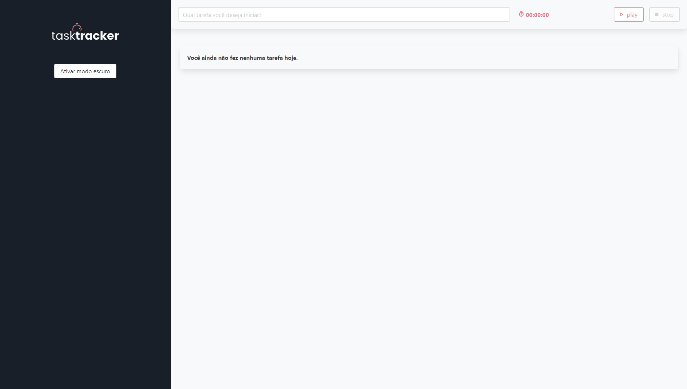

# TaskManager App

This is a solution to the [Alura Vue Course](https://cursos.alura.com.br/course/vue3-comecando-framework/).

## Table of contents

-   [Overview](#overview)
    -   [The challenge](#the-challenge)
    -   [Screenshot](#screenshot)
    -   [Links](#links)
-   [My process](#my-process)
    -   [Built with](#built-with)
    -   [What I learned](#what-i-learned)
-   [Author](#author)
-   [Build](#build)

## Overview

This is a Task Tracker that you can put your tasks for the day and count how long it takes to do them.

### The challenge

Users should be able to:

-   View the optimal layout for the app depending on their device's screen size
-   See hover states for all interactive elements on the page
-   Write a task on input and put play to run the timer and stop when is done.

### Screenshot



### Links

-   Live Site URL: Soon... <!--  [Add live site URL here](https://your-live-site-url.com) -->

## My process

We use the Vue.js 3 Tools and Bulma for the styles.

### Built with

-   Semantic HTML5 markup
-   [VueJS](https://vuejs.org/) - JS library
-   [Bulma](https://bulma.io/) - CSS framework

### What I learned

I'am learning how to work better with Vue.js 3 and how work this CSS frameworks because i have used other extensions like SASS, Stylus and Styled-Components but i never used something like Bulma or Tailwind.

## Author

-   [Website](https://dellaquila.dev)
-   [Frontend Mentor](https://www.frontendmentor.io/profile/rafaeldellaquila)
-   [Twitter](https://www.twitter.com/rfldllql)

## Overview

You can build this project cloning this repo and installing with yarn and serve this on a localhost.

```bash
git clone https://github.com/rafaeldellaquila/tasktracker.git
```

```bash
yarn install
```

```bash
yarn serve
```
